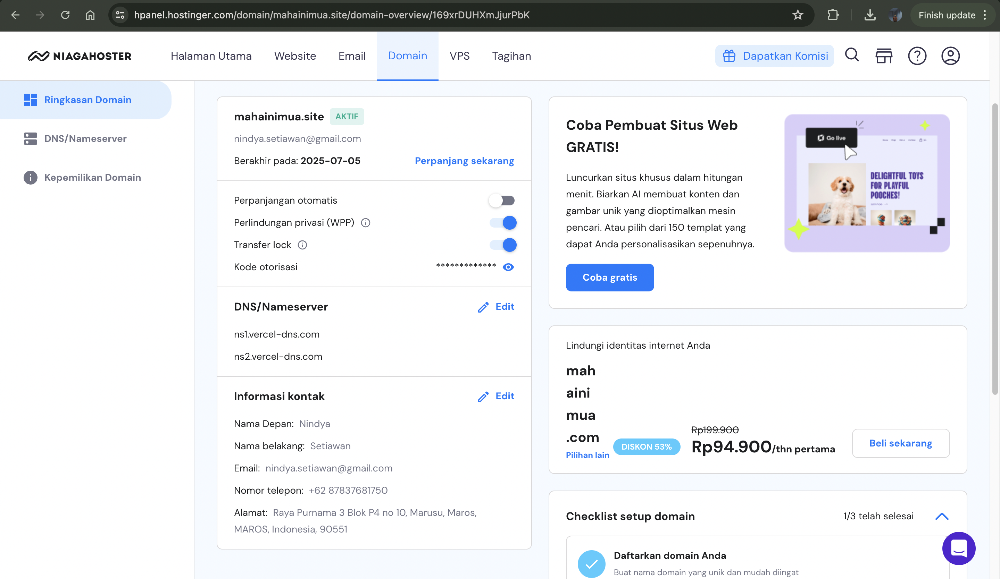
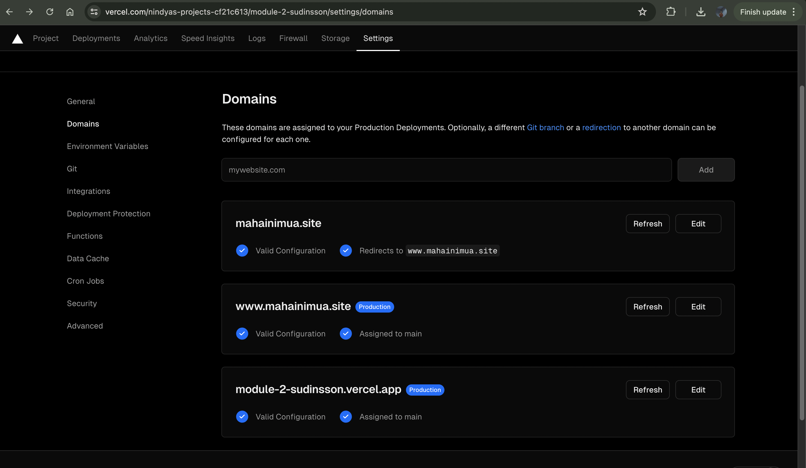

Panduan Lengkap Deploy Project ke Vercel dengan Domain Mahainimua.site
Tujuan:

Membuat panduan langkah demi langkah untuk deploy project ke Vercel dengan domain Mahainimua.site yang dihosting oleh Niagahoster dan dihubungkan dengan akun Vercel.

Langkah-langkah:

1. Membeli Domain Mahainimua.site di Niagahoster:

a. Buka situs web Niagahoster (https://www.niagahoster.co.id/).
b. Buat akun atau login jika sudah memiliki akun.
c. Pilih menu "Domain" di dashboard.
d. Cari domain "Mahainimua.site" dan periksa ketersediaannya.
e. Lanjutkan proses checkout dan pilih metode pembayaran QRIS.
f. Selesaikan pembayaran menggunakan QRIS.

2. Membuat Akun Vercel:

a. Buka situs web Vercel (https://vercel.com/).
b. Buat akun baru atau login jika sudah memiliki akun.
c. Pilih opsi "Connect to Git" dan pilih platform Git yang Anda gunakan (misalnya, GitHub, GitLab).
d. Hubungkan akun Vercel Anda dengan repository komunitas yang ingin Anda deploy.
e. Buat repository privat baru di platform Git yang Anda pilih.
f. Fork repository komunitas ke repository privat Anda.
g. Hubungkan repository privat Anda dengan akun Vercel Anda.

3. Deploy Project ke Vercel:

a. Di dashboard Vercel, pilih project repository privat Anda.
b. Klik tombol "Deploy" di bagian atas halaman.
c. Vercel akan secara otomatis mendeteksi framework dan konfigurasi project Anda.
d. Ikuti petunjuk yang muncul di layar untuk menyelesaikan proses deploy.
e. Vercel akan memberikan URL deployment project Anda.

4. Memasukkan Nameserver Vercel ke Nameserver Domain di Niagahoster:

a. Buka dashboard Niagahoster.
b. Pilih menu "Domain" dan pilih domain "Mahainimua.site".
c. Buka tab "Nameserver".
d. Salin nameserver Vercel yang Anda dapatkan di langkah 3.
e. Ganti nameserver domain di Niagahoster dengan nameserver Vercel yang Anda salin.
f. Tunggu beberapa saat agar propagasi nameserver selesai.

5. Mengakses Project dengan Domain Mahainimua.site:

a. Buka browser web Anda.
b. Ketikkan alamat domain "Mahainimua.site" di address bar.
c. Project Anda yang dideploy di Vercel akan ditampilkan.

Catatan:

Pastikan Anda telah mengikuti semua langkah dengan benar.
Jika Anda mengalami masalah, Anda dapat menghubungi tim support Niagahoster atau Vercel untuk mendapatkan bantuan.
Kesimpulan:

Dengan mengikuti panduan ini, Anda dapat deploy project Anda ke Vercel dengan domain Mahainimua.site yang dihosting oleh Niagahoster dengan mudah dan cepat.

tune

share

more_vert
